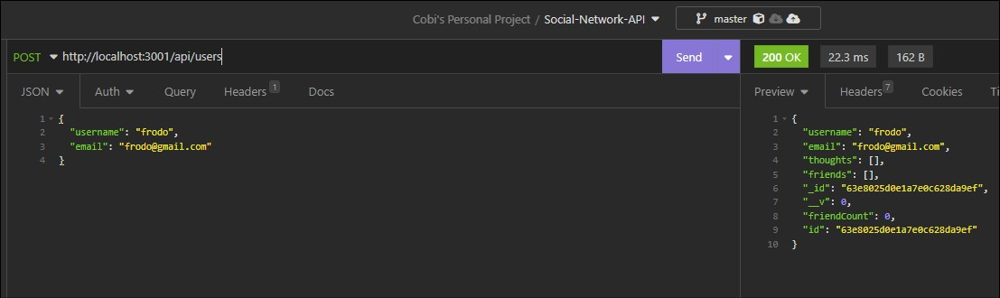

# Social-Network-API

## <section id = "License">License</section>
N/A

## <section id = "Description">Description</section>

This is a backend web application that was made made using MongoDB and Express. Users of the application can make an account, add/delete friends, create/update thoughts and create reactions. Insomnia was used to test all get, post, put, and delete routes.

Link to video demonstration: 

## Table of Contents
1.) <a href = "#License">License</a> 
2.) <a href = "#Description">Description</a> 
3.) <a href = "#Installation">Installation</a>  
4.) <a href = "#Usage">Usage</a> 
5.) <a href = "#Contributing">Contributing</a> 
6.) <a href = "#Tests">Tests</a> 
7.) <a href = "#Questions">Questions</a>

## <section id = "Installation">Installation</section>
Command to Install Dependencies: npm i

## <section id = "Usage">Usage</section>
Using the Repo: N/A 

## <section id = "Contributing">Contributing</section>
Contributing to the Repo: Currently not taking contributions.

## <section id = "Tests">Tests</section>
Command to Run Tests: N/A

## <section id = "Questions">Questions</section>
If you have any questions, please feel free to contact me:   
1.) Github Username: Cgotts1  
2.) Email Address: cobi.gottschalk@gmail.com
